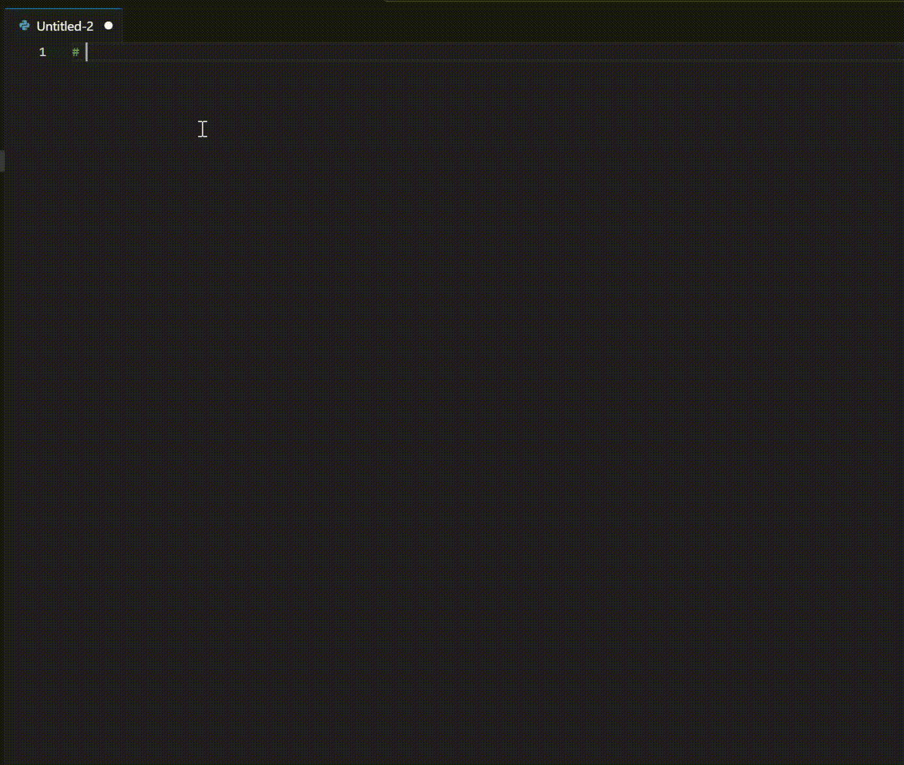
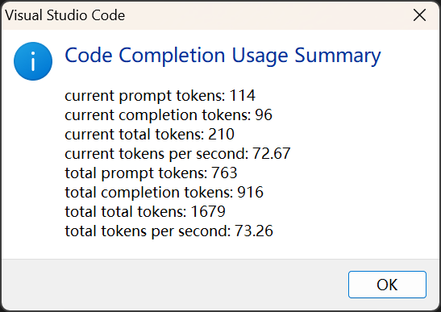

# XInference Code Assistant README

This is the VSCode extension for [Xinference](https://github.com/xorbitsai/inference) code completions API. It can automatically complete the code based on the context.

## Features

The extension provides the following features:

- Auto complete the code based on the context.

  You could type the code and press `Ctrl+Shift+L` to show the suggest, then select one of them. And if you enable the `auto suggest`, it will auto show the suggest when you are typing.

- Code completion usage summary:

  You can see the usage summary of code completions in the status bar, and you can click it to see the more detailed usage summary in the dialog.
  

## Requirements

You should need the VSCode version 1.73 or above.

## Extension Settings

This extension contributes the following settings:

- `xinf-coder.enableAutoSuggest`: Enable/disable auto suggest, if enabled, it will auto show the suggest when you are typing. If disabled, you need to press `Ctrl+Shift+L` to show the suggest.
- `xinf-coder.endpoint`: The Xinference URL, please set it to the xinference server ip or domain name.
- `xinf-coder.codeModel`: The code model name, please set it to the code model you want to use. Note: only the model with `code` ability can be used.
- `xinf-coder.fillInTheMiddle`: Fill in the middle of the code, if enabled, it will send the code before and after cursor, and fill the generated code in the middle of the code. Otherwise, it only send the code before cursor and fill the generated code after the cursor.
- `xinf-coder.temperature`: The temperature of the generated code. -2.0 ~ 2.0, the larger the temperature is, the more random the generated code will be. Default 0.2 is the good value.
- `xinf-coder.maxNewTokens`: The maximum number of tokens to generate. 50 ~ 100 is a good value.
- `xinf-coder.contextWindow`: The context window size, the larger the value is, the more context will be used. It cannot be larger than the max model context length on the server side.

## Release Notes

### 0.1.0

Initial release of XInference Code Assistant.
